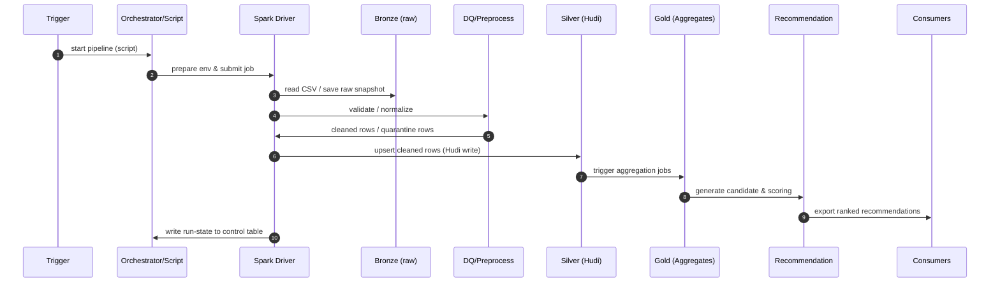

# ETL Sequence Diagram — Ecommerce Seller Recommendation

This one-page text sequence diagram documents the ETL flow used in the project. It contains an ASCII/text flow (easy to embed in plain documents) and a Mermaid diagram (renderable in markdown viewers that support Mermaid).

-----

ASCII SEQUENCE (plain text)

Trigger (user/scheduler)
  |
  |  Start pipeline (run `etl_company_sales_spark_submit.sh`)
  v
Orchestrator / Wrapper Script
  |
  |  -> prepare env, jars, spark-submit args
  |  -> read config (`conf/hudi-defaults.conf`, `libs/hudi_config.py`)
  v
Spark Driver (Job Entry)
  |
  |  -> Read raw input CSV (local or `s3a://...`)  
  |     e.g. `local/data/input/company/company_sales_dirty.csv`
  v
Bronze (Raw Snapshot)
  |
  |  -> Persist snapshot (immutable) for audit
  v
DQ & Pre-processing
  |
  |  -> Validate required fields, parse numbers/timestamps
  |  -> Normalize fields, flag invalid rows
  |  -> Write invalid rows -> Quarantine path
  v
Silver (Hudi table write / upsert)
  |
  |  -> Cleaned records upserted into Hudi (COW/MOR)
  |  -> Hudi commit metadata (.hoodie) maintained
  v
Gold (Aggregates & Features)
  |
  |  -> Compute seller-level aggregates, RFM, growth & velocity
  |  -> Persist gold views / recommendation candidates
  v
Recommendation Engine / Export
  |
  |  -> Rank candidates, produce final recommendation lists
  |  -> Persist to `local/data/output/gold/recommendations` or publish to service
  v
Consumers (Dashboards / API / Reports)

Extra flows:
- Control/state update: after each successful run, write run metadata to `state_table_path` (control table) for idempotency
- Incremental runs: use Hudi incremental read or Delta time-travel as configured

-----

Mermaid (renderable)

-----

How to include

- Copy the ASCII block into the final report for a plain-text diagram.  
- Use the Mermaid block in `README.md` or a Markdown viewer that supports Mermaid to render the diagram visually.

-----

File saved: `SEQUENCE_DIAGRAM.md` (drop into your final submission folder alongside `README.md`).
